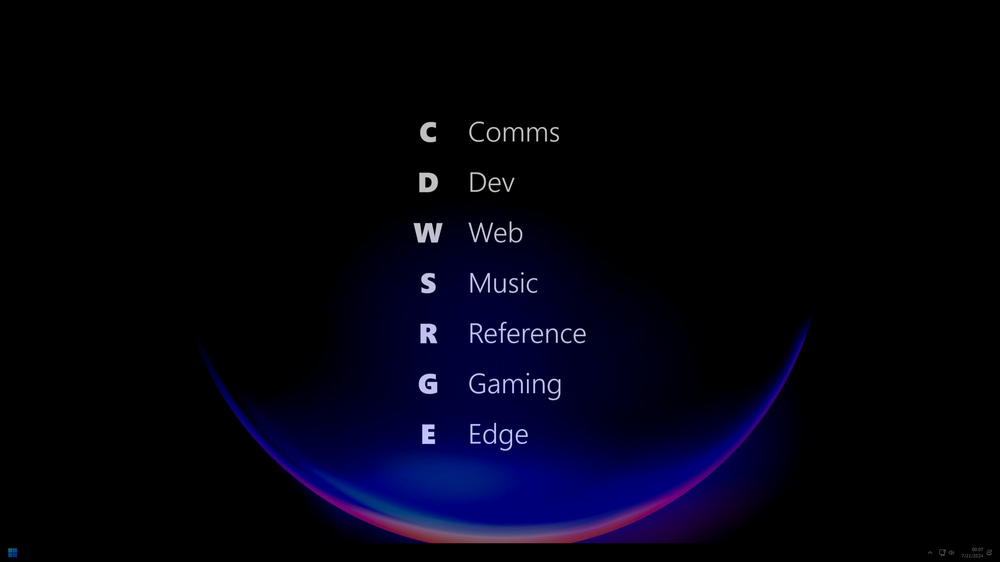
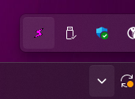

# ⚡ FlashCom

FlashCom is a lightning fast command launcher for Windows power users.

Create a "command tree" to assign a hotkey-based hierarchy to all of your most
common commands, then instantly execute them by invoking FlashCom and traversing
the tree.

**Lightweight, fast, and minimal**: FlashCom is a small Win32 native process
and uses Windows Composition APIs to render beautiful visuals without a heavy
UI framework or bundled browser.

[](design/Screenshot.png)

# Usage

Download the [latest release from GitHub](https://github.com/haydenmc/FlashCom/releases/latest),
or [install from the Windows Store](https://apps.microsoft.com/detail/9P46ZB80RWL8).

Be sure to install the latest
[Microsoft VC Redistributable](https://learn.microsoft.com/en-us/cpp/windows/latest-supported-vc-redist?view=msvc-170#latest-microsoft-visual-c-redistributable-version)
if you are not using the packaged or Windows Store app.

After launching, FlashCom will appear in your system tray as a pink lightning bolt.



**FlashCom can then be invoked by pressing Win+Space.**

# Settings

To customize the command tree, right click the tray icon and select "Settings,"
then edit the `settings.json` shown.

`settings.json` is used to customize the command tree shown in FlashCom along
with other settings.

For the packaged app, `settings.json` is located in `%LOCALAPPDATA%\Packages\164HaydenMcAfee.FlashCom_nqvw84mb3bsjc\LocalState`.

For the unpackaged app, `settings.json` is located in `%LOCALAPPDATA%\FlashCom`.

## Commands

| Name         | "type"           | Description                                |
| ------------ | ---------------- | ------------------------------------------ |
| [ShellExecute Command](#shellexecute-command) | `"shellExecute"` | Launches arbitrary Windows executables. |
| [URI Command](#uri-command) | `"uri"` | Activates the given URI with the default protocol handler. |
| [AUMID Command](#aumid-command) | `"aumid"` | Activates the Windows Packaged app with the given AUMID. |

The `"commands"` field defines the set of commands shown in FlashCom:

```json
{
    "commands": [
        {
            "name": "Calculator",
            "key": "C",
            "type": "shellExecute",
            "executeFile": "calc.exe",
            "executeParameters": ""
        },
        {
            "name": "Notepad",
            "key": "N",
            "type": "shellExecute",
            "executeFile": "notepad.exe",
            "executeParameters": ""
        }
    ]
}
```

A command can be one of several types. The `"type"` field will determine what
happens when the command is executed.

A command can also serve as a container or folder for other commands. These
commands don't have a `"type"` field, but instead have a `"children"` field:

```json
{
    "commands": [
        {
            "name": "Tools",
            "key": "T",
            "children": [
                {
                    "name": "Calculator",
                    "key": "C",
                    "type": "shellExecute",
                    "executeFile": "calc.exe",
                    "executeParameters": ""
                },
                {
                    "name": "Notepad",
                    "key": "N",
                    "type": "shellExecute",
                    "executeFile": "notepad.exe",
                    "executeParameters": ""
                }
            ]
        }
    ]
}
```

### ShellExecute Command

These commands simply run the given executable file with the provided
parameters.

| Field                 | Type                  | Description |
| --------------------- | --------------------- | ----------- |
| `"type"`              | _required_ **string** | `"shellExecute"` |
| `"executeFile"`       | _required_ **string** | Path to executable to launch. |
| `"executeParameters"` | _optional_ **string** | Arguments to provide when launching the executable. |
| `"executeDirectory"`  | _optional_ **string** | Working directory where the executable will be started. |

#### Examples

```json
{
    "commands": [
        {
            "name": "Calculator",
            "key": "C",
            "type": "shellExecute",
            "executeFile": "calc.exe"
        },
        {
            "name": "Spotify Web",
            "key": "S",
            "type": "shellExecute",
            "executeFile": "msedge.exe",
            "executeParameters": "--app=\"https://open.spotify.com\""
        },
        {
            "name": "C Drive",
            "key": "A",
            "type": "shellExecute",
            "executeFile": "C:\\Windows\\explorer.exe",
            "executeParameters": "C:\\"
        },
        {
            "name": "VS Code",
            "key": "A",
            "type": "shellExecute",
            "executeFile": "C:\\Users\\Hayden\\AppData\\Local\\Programs\\Microsoft VS Code\\Code.exe",
            "executeParameters": "",
            "executeDirectory": "C:\\Users\\Hayden\\AppData\\Local\\Programs\\Microsoft VS Code"
        }
    ]
}
```

### URI Command

These commands launch the given URI using the default protocol handler.
In addition to launching websites, you can also use these commands to launch
applications that use protocol activation.

| Field                 | Type                  | Description |
| --------------------- | --------------------- | ----------- |
| `"type"`              | _required_ **string** | `"uri"` |
| `"uri"`               | _required_ **string** | URI to activate. |

#### Examples

```json
{
    "commands": [
        {
            "name": "Steam Library",
            "key": "S",
            "type": "uri",
            "uri": "steam://open/games"
        },
        {
            "name": "Obsidian",
            "key": "B",
            "type": "uri",
            "uri": "obsidian://open?vault=Personal"
        },
        {
            "name": "Hacker News",
            "key": "A",
            "type": "uri",
            "uri": "https://news.ycombinator.com"
        }
    ]
}
```

### AUMID Command

Packaged apps on Windows can be activated using an "application user model id"
or AUMID.

An AUMID is a string consisting of a "Package Family Name" followed by `!` and
the application ID you wish to launch. For example, the Clock app on Windows can
be launched with the AUMID `Microsoft.WindowsAlarms_8wekyb3d8bbwe!App`.

An easy way to find the AUMID for an installed app is to use the
[`Get-AppPackage`](https://learn.microsoft.com/en-us/powershell/module/appx/get-appxpackage)
PowerShell command to find the package family name and installation location,
then look at the `AppxManifest.xml` in the installation location to determine
the Application ID you wish to launch.

| Field                 | Type                  | Description |
| --------------------- | --------------------- | ----------- |
| `"type"`              | _required_ **string** | `"aumid"` |
| `"aumid"`             | _required_ **string** | Application User Model ID of the packaged application to activate. |

#### Examples

```json
{
    "commands": [
        {
            "name": "Alarms + Clock",
            "key": "A",
            "type": "aumid",
            "aumid": "Microsoft.WindowsAlarms_8wekyb3d8bbwe!App"
        },
        {
            "name": "foobar2000",
            "key": "F",
            "type": "aumid",
            "aumid": "Resolute.foobar2000modern_cg7j1awqsza28!foobar2000"
        }
    ]
}
```

# Troubleshooting

If FlashCom refuses to start, you may have an error in your `settings.json`.
Read the above and ensure your file conforms to the guidance.

If `settings.json` is deleted FlashCom will generate a default `settings.json`
that is known to work.

FlashCom stores log files alongside `settings.json` in these locations:
- **Packaged App:** `%LOCALAPPDATA%\Packages\164HaydenMcAfee.FlashCom_nqvw84mb3bsjc\LocalState\FlashCom.log`
- **Unpackaged:** `%LOCALAPPDATA%\FlashCom\FlashCom.log`

Also ensure you have the latest
[Microsoft VC Redistributable](https://learn.microsoft.com/en-us/cpp/windows/latest-supported-vc-redist?view=msvc-170#latest-microsoft-visual-c-redistributable-version)
installed.

If you're still running into problems please file an issue and attach your
`FlashCom.log` file (note that the log file may contain information present in
your `settings.json`, remove any information that you don't want revealed before
posting).

# Third Party Libraries

## [nlohmann/json](https://github.com/nlohmann/json)

```text
MIT License 

Copyright (c) 2013-2022 Niels Lohmann

Permission is hereby granted, free of charge, to any person obtaining a copy
of this software and associated documentation files (the "Software"), to deal
in the Software without restriction, including without limitation the rights
to use, copy, modify, merge, publish, distribute, sublicense, and/or sell
copies of the Software, and to permit persons to whom the Software is
furnished to do so, subject to the following conditions:

The above copyright notice and this permission notice shall be included in all
copies or substantial portions of the Software.

THE SOFTWARE IS PROVIDED "AS IS", WITHOUT WARRANTY OF ANY KIND, EXPRESS OR
IMPLIED, INCLUDING BUT NOT LIMITED TO THE WARRANTIES OF MERCHANTABILITY,
FITNESS FOR A PARTICULAR PURPOSE AND NONINFRINGEMENT. IN NO EVENT SHALL THE
AUTHORS OR COPYRIGHT HOLDERS BE LIABLE FOR ANY CLAIM, DAMAGES OR OTHER
LIABILITY, WHETHER IN AN ACTION OF CONTRACT, TORT OR OTHERWISE, ARISING FROM,
OUT OF OR IN CONNECTION WITH THE SOFTWARE OR THE USE OR OTHER DEALINGS IN THE
SOFTWARE.
```

## [utfcpp](https://github.com/nemtrif/utfcpp/)

```text
Boost Software License - Version 1.0 - August 17th, 2003

Permission is hereby granted, free of charge, to any person or organization
obtaining a copy of the software and accompanying documentation covered by
this license (the "Software") to use, reproduce, display, distribute,
execute, and transmit the Software, and to prepare derivative works of the
Software, and to permit third-parties to whom the Software is furnished to
do so, all subject to the following:

The copyright notices in the Software and this entire statement, including
the above license grant, this restriction and the following disclaimer,
must be included in all copies of the Software, in whole or in part, and
all derivative works of the Software, unless such copies or derivative
works are solely in the form of machine-executable object code generated by
a source language processor.

THE SOFTWARE IS PROVIDED "AS IS", WITHOUT WARRANTY OF ANY KIND, EXPRESS OR
IMPLIED, INCLUDING BUT NOT LIMITED TO THE WARRANTIES OF MERCHANTABILITY,
FITNESS FOR A PARTICULAR PURPOSE, TITLE AND NON-INFRINGEMENT. IN NO EVENT
SHALL THE COPYRIGHT HOLDERS OR ANYONE DISTRIBUTING THE SOFTWARE BE LIABLE
FOR ANY DAMAGES OR OTHER LIABILITY, WHETHER IN CONTRACT, TORT OR OTHERWISE,
ARISING FROM, OUT OF OR IN CONNECTION WITH THE SOFTWARE OR THE USE OR OTHER
DEALINGS IN THE SOFTWARE.
```

## [spdlog](https://github.com/gabime/spdlog)

```text
The MIT License (MIT)

Copyright (c) 2016 Gabi Melman.                                       

Permission is hereby granted, free of charge, to any person obtaining a copy
of this software and associated documentation files (the "Software"), to deal
in the Software without restriction, including without limitation the rights
to use, copy, modify, merge, publish, distribute, sublicense, and/or sell
copies of the Software, and to permit persons to whom the Software is
furnished to do so, subject to the following conditions:

The above copyright notice and this permission notice shall be included in
all copies or substantial portions of the Software.

THE SOFTWARE IS PROVIDED "AS IS", WITHOUT WARRANTY OF ANY KIND, EXPRESS OR
IMPLIED, INCLUDING BUT NOT LIMITED TO THE WARRANTIES OF MERCHANTABILITY,
FITNESS FOR A PARTICULAR PURPOSE AND NONINFRINGEMENT.  IN NO EVENT SHALL THE
AUTHORS OR COPYRIGHT HOLDERS BE LIABLE FOR ANY CLAIM, DAMAGES OR OTHER
LIABILITY, WHETHER IN AN ACTION OF CONTRACT, TORT OR OTHERWISE, ARISING FROM,
OUT OF OR IN CONNECTION WITH THE SOFTWARE OR THE USE OR OTHER DEALINGS IN
THE SOFTWARE.
```